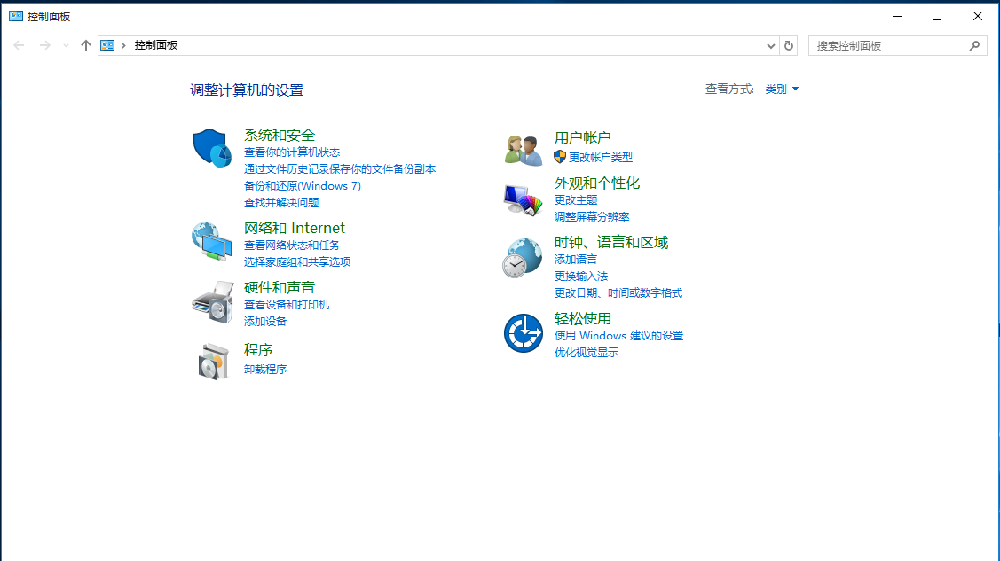

## 小型企业通过 pptp 实现远程办公

#### 前言
pptp是一个比较简单的vpn连接工具，具体细则各位可在网上了解。该服务较适合以下场景：
- 对安全性要求不高。
- 希望部署安装简单。
- 希望自身电脑可以在外网环境下连接内网办公环境。

特别提醒:
> 1. 此处与远程操控是两种概念。
> 2. mac book 取消了pptp连接方式，如果希望使用，建议下载第三方工具（如：shimo)。

#### 方案
小型企业搭建pptp服务器方式常见的有两种：
1. 通过一些自身具备vpn功能的路由器，直接进行pptp配置。此方案相对简单。
2. 通过路由器端口映射功能，将路由器接收外网的某一端口定向转到内网的某台pptp机器上，从而提供pptp服务的使用。

#### 安装
此处略，网上有许多教程...

#### 客户端使用步骤(window10)
  
step 1：进入系统的 “控制面板”， 选择 “网络和Internet” 操作项。

  
step 2：在 “网络和Internet” 内容区中， 选择 “网络和共享中心” 操作项。

  
step 3: 在 “网络和共享中心” 内容区中， 选择 “设置新的连接或网络”。

  
step 4: 选择 “连接到工作区”, 点击到下一步。

  
step 5: 选择 “使用我的 Internet 连接（VPN）”。

  
step 6： 输入 pptp服务器公网的 “internet 地址”。  
注： “目标名称” 可以按照个人管理网络适配器的习惯填写（类似windows系统文件夹名称）。

  
step 7： 完成上述6步后，系统将会在下列系统路径下

> “控制面板” -> “wangluo he Internet” -> “网络和共享中心” -> “更改适配器设置”  

中，多出一个 刚刚创建的网络VPN网络适配器，如上图。

  
step 8: 选中 “新建的网络适配器” 点击右键，选择 “属性”，弹出对话框，切换至“安全”选项卡中，并按照上图进行配置。

  
step 9：配置完成后，点击 “确定” -> "是" 按钮。

  
step 10: 选中 “新建的网络适配器” 点击右键，选择 “进行网络链接”，会跳出vpn对话框，点击连接，则弹出输入账号、密码选项，完成即可。
