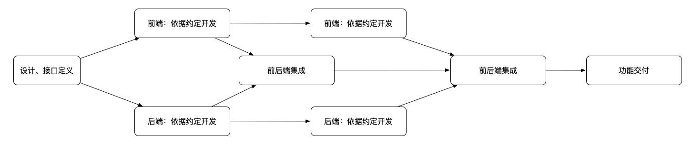
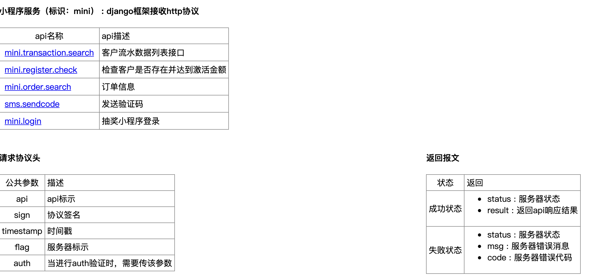
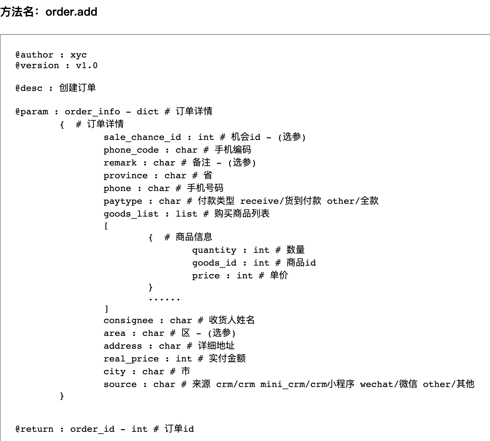

## 研发定义接口


#### 前言
历史惊人的相似，基于web开发的发展历程，逐步出现了人类进步过程中的分工现象，而这一现象最明显的体现就在于由原始的前后端混合开发向前后端分离开发的转换。这一分工的出现，才造成了一个有趣的中间环节的的产生 —— 接口定义。

该名词并不是源于前后端分离的开发模式后才出现的，确切的说早在许久之前，架构师就要求必须学会接口定义，在传统的软件开发中，“接口”不仅仅应用在前后端开发上，很大层面上，只要涉及到对接，可能是协作，可能是单抗，都有可能面临到定义接口的问题，我们可以认为两个方法间跳来跳去，我们认为是“接口”，我们也可认为俩个人员商量协作开发，约定用某种方式进行数据传输，该行为我们也认为是“接口”。所以，接口是是非常普遍的，它存在于软件开发过程中的方方面面。而“接口定义”在软件开发过程中就更为重要了，主要体现于：

- 接口定义 是一种约定俗称的规范
- 接口定义 是全局化思考的一种工具
- 接口定义 是可以避免后续出现不必要返工的有利武器

故接口定义在软件开发工作流中必不可少。


#### 案例
> 注：例子中是以前后端分离协作方式讲述的，意图在于处理多人协作，暂不考虑单人开发场景。

```
公司想要做一个客户关系管理系统（CRM)，当前要实现以下功能：

    1. 管理员可以登录系统
    2. 管理员可以创建员工信息
    3. 管理员可以创建员工账号
    4. 员工可以登录系统
    5. 员工可以修改个人密码
    6. 员工可以修改个人信息

现有前后端两位开发人员，共同去开发该需求，项目经理该如何安排开发？
```
以上需求是一个简单的个人账户及信息管理的需求。大多数开发人员往往会接到需求，不假思索的开始逐一去做，在做的过程中时，可能会出现一定的返工。如：

> 管理员 和 员工 从角色上来看就是相同的，所以，管理员和员工在登录方面并无区别。固 1、4设计时，可以考虑是一种角色。  

往往很多人在不进行全局思索时，往往会出现1、4分别做，期间如果发现共性，则会造成出现一定的返工，如果没发现，则会造成抽象的不彻底，代码的冗余。故不便后期的维护及功能的扩展。

而养成“接口定义”的研发人员，往往会通过该习惯进行全局化思考，看看在接口定义的过程中，各个接口在全局性流程中所处的位置及抽象，从设计上避免了一定的代码冗余及后期扩展。（属于开发前设计部分，此部分可以考虑结合UML语言进行）

回归正题，上述问题对于项目经理来看，往往在排期时会考虑如何并行处理，所谓的并行就是协同的多方并没有依赖于协同对象就可以进行相关的操作。前后端开发过程中，前端依赖于后端的接口开发、调试、单元测试。也就意味着，后端没有开发完，前端无法进行工作。而接口定义恰恰解决了该问题。接口定义不仅仅解决了上述的设计不合理及代码冗余现象，同时他也为协同作业的相关人员定义好了规范，通过接口定义，前端人员可以不依赖于后端人员的接口，而进行相应的开发工作，后端也不需要因为前端的催促而写出临时性的低质量的代码。故两方仅需按照一定的约束，即可完成相关的开发，并在某一时刻完成集成即可，从而将一件有先后顺序的事情，改变成了并行处理的事情。如下图：



**分析**

由题目中可知，管理员 和 员工 我们都可以看做是一种叫员工的角色，二者的最大区别可能在使用功能上有所不同，故二者的差别在于权限，但角色方面是固定的，又因为角色是一种身份，但要想做登录，则需要一个验证身份的方式，在此我们可以考虑最简单账号密码方式来进行身份验证。故分析完成后，我们可以认为该需求所需要的实体为：

> 设计实体：账号  -->  员工  -->  权限（此处暂不考虑）

故需要提供的以下接口：
- 员工账号登录接口
- 员工列表接口（和搜索是同一个接口）
- 员工信息创建接口
- 员工账号创建接口
- 员工修改个人信息接口
- 员工账号修改密码接口
- 员工退出登录接口（推到出来的接口，因为有登录就必然要有退出）

注：管理员的账号需要在系统初始化时初始完成。


**接口设计**

接口设计过程中从宏观角度，更多的考虑的是输入、输出：
```python
def add(first, second):
    return first + second
```
如上，上文中定义了一个加法函数（在我们看来，函数方法也会被定义接口 - 广义接口），此方式中，输入为：first，second连个参数，输出则是 first + second 的结果值，而我们并不关心里面的具体实现，只需要知道他帮我们实现了什么。同理，在前后端接口定义过程中也是如此。

在前后端定义接口的过程中，往往我们会有些基础协议，所谓的基础协议是为了解决前后端在数据传输方面，用户验证方面以及信息安全等方面保证其可以正常运作的，常见的基础协议往往会带有如下信息：

协议输入：
> 1. 数据正确性：签名（signature)往往是用于保证数据正确性。（在复杂的网络环境中，经常监听网络信息，串改网络数据，造成客户端明明想传输“您好”，却到服务器变成了“你是山炮”的现象）
> 2. 时效性：为了保证服务器时间与客户端时间偏差，或是服务器接收时间远远超出了客户端应该收到响应的范围内。
> 3. 路由：往往涉及前后端接口时，需要考虑一定的路由规则，常见的方式是采用restful，但restful仅仅是一种概念，具象话的形式有很多种。在这方面我更建议采用“域名空间”方式。例：crm.staff.add, crm.staff.list, crm.staff.search ...
> 4. 信息安全性：针对传输的数据，如果单纯以html进行明文传输，很容易造成信息的泄露，对此，有些项目会考虑用一定的加密解密方式来将明文转为密文，最终将密文用于传输，当然，这要看系统的安全级别，如果安全级别要求不高，可以考虑entity code;

协议输出：
> 1. 状态：因为协议只是在逻辑处理部分起到作用，固该状态代表着服务器接收到响应后所对应的状态。（传输协议由ISO7层模型来处理，在此我们不考虑传输协议）
> 2. 数据：基于协议的状态，返回响应的数据值，同时，该部分同样可以考虑信息安全性。

案例：


之后，我们在定义具体的接口是，与我们所看到函数区别就没太多的不同了，此部分我们仍然需要定义好相应的输入、输入，如下：


至此，接口定义的思路、常见形式、案例基本讲解完成了。如有疑问可以联系本人。


